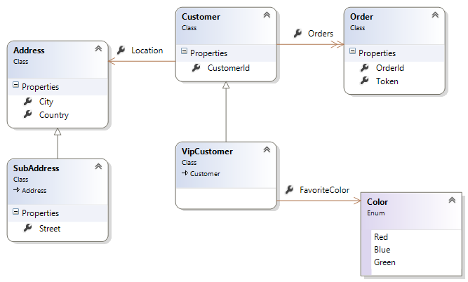

The data model is the basis of an OData service. OData service uses an abstract data model called **Entity Data Model** (*EDM*) to describe the exposed data in the service. OData client can issue a *GET* request to the root URL of the OData service with `$metadata` to get an XML representation of the service's data model. 
In Microsoft ASP.NET Web API 2.2 for OData v4.0, to build a data model for OData service is to create an `IEdmModel` object. There are three ways to build an EDM model in Web API OData:

1. Explicit Edm Model Builder
2. Implicit, non-convention model builder or fluent API
3. Implicit, convention model builder.

### 2.1.1 Build Edm Model
Let’s see the difference between them.

#### Explicit model builder
To build an Edm model explicitly is to create an `IEdmModel` object by directly using APIs in **[ODatalib](https://www.nuget.org/packages/Microsoft.OData.Core/)**. The basic code structure to build an Edm model explicitly is shown as:

public IEdmModel GetEdmModel()
{
    EdmModel model = new EdmModel();
    // ......
    return model;
}

The Edm Model built by this way is called **un-typed** (or **typeless, week type**) Edm model. Owing that there is no corresponding CLR classes.

#### Non-convention model builder
To build an Edm model using non-convention model builder is to create an `IEdmModel` object by directly call fluent APIs of `ODataModelBuilder`. The developer should take all responsibility to add all Edm types, operations, associations, etc into the data model one by one. The basic code structure of this way is shown as:

public static IEdmModel GetEdmModel()
{
    var builder = new ODataModelBuilder();
    // ......
    return builder.GetEdmModel();
}


#### Convention model builder
To build an Edm model using convention model builder is to create an `IEdmModel` object by a set of conventions. Such conventions are pre-defined rules in Web API OData to help model builder to identify Edm types, keys, association etc automatically, and build them into the final Edm model. `ODataConventionModelBuilder` wrappers these conventions and apply them to the Edm model when building. The basic code structure of this way is shown as:

public static IEdmModel GetEdmModel()
{
    var builder = new ODataConventionModelBuilder();
    // ......
    return builder.GetEdmModel();
}


Basically, it’s recommended to use convention model builder to build Edm model for its simplicity and convenience. However, if user wants to make more control on the model building, or he doesn’t have the corresponding CLR classes, the non-convention model builder and the explicitly method are also very useful.

### 2.1.2 Edm Model Sample 
We’ll build an Edm model using the above three methods in the following sections respectively. Each section is designed to walk you through every required aspect to build such Edm model. First of all, let’s have a brief view about the Edm model we will build.
This is a *Customer-Order* business model, in which three entity types, two complex types and one enum type are included. Here’s the detail information about each types:

• **Customer** is served as an entity type with three properties. 

public class Customer
{
    public int CustomerId { get; set; } // structural property, primitive type, key
    public Address Location { get; set; } // structural property, complex type
    public IList<Order> Orders { get; set; } // navigation property, entity type
}


• **VipCustomer** is an entity type derived from **Customer**. It includes one more property:

public class VipCustomer : Customer
{
    public Color FavoriteColor { get; set; } // structural property, primitive type
}


• **Order** is another entity type with two properties.

public class Order
{
    public int OrderId { get; set; } // structural property, primitive type, key
    public Guid Token { get; set; } // structural property, primitive type
}


• **Address** & **SubAddress** are served as complex types, while **SubAddress** is derived from **Address**.

public class Address
{
    public string Country { get; set; }
    public string City { get; set; }
}

public class SubAddress : Address
{
    public string Street { get; set; }
}


• **Color** is served as an Enum Type.

public enum Color
{
    Red,
    Blue,
    Green
}


Here's the class heritance:

